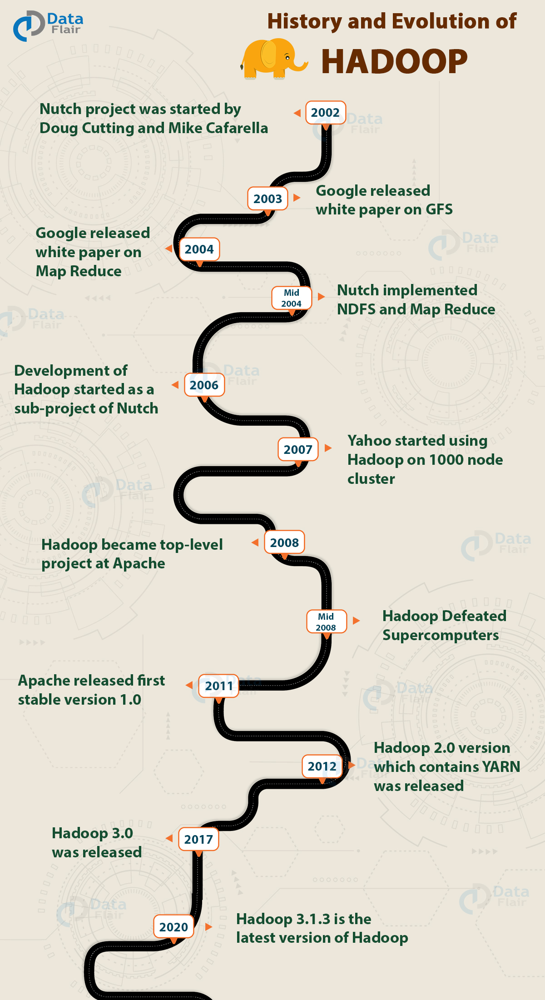
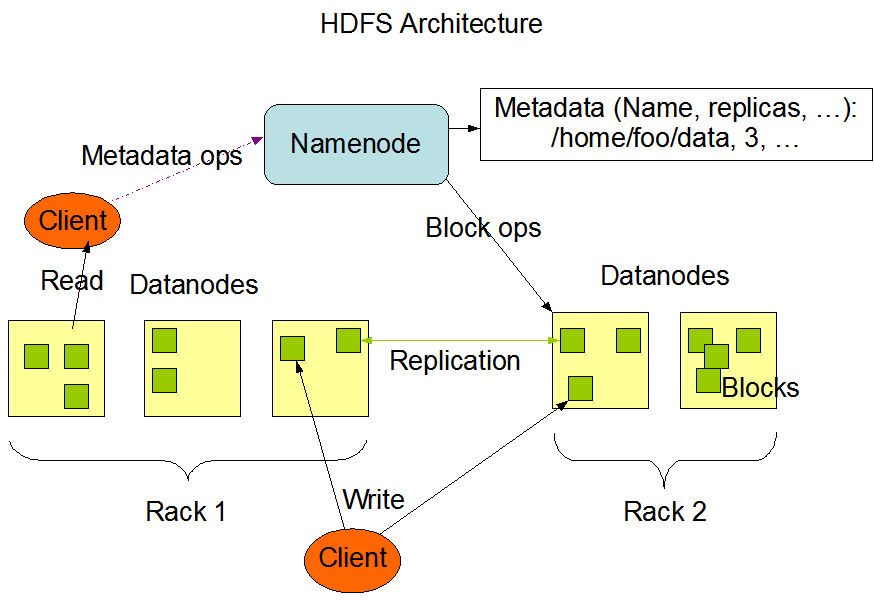
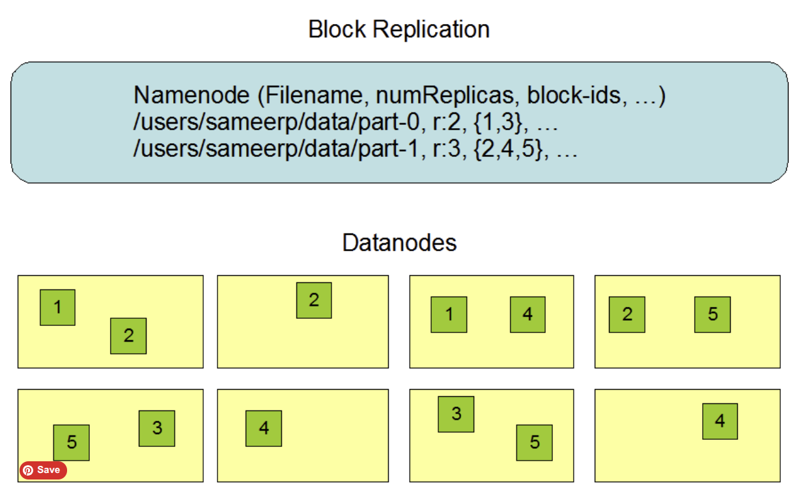
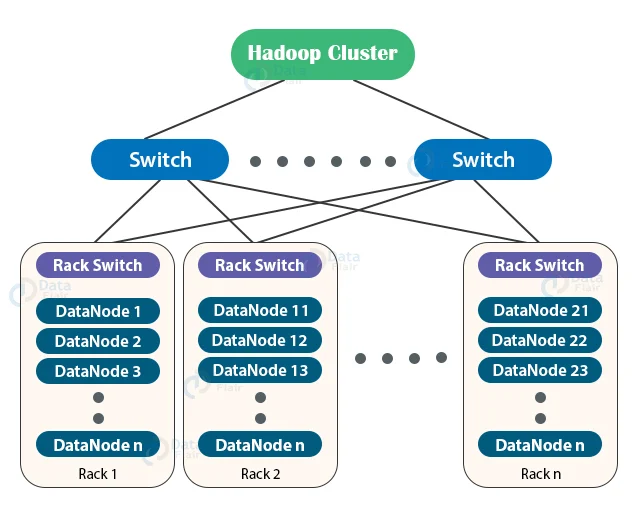
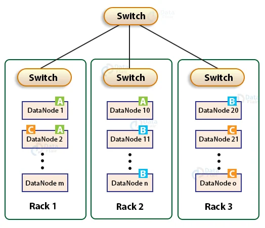
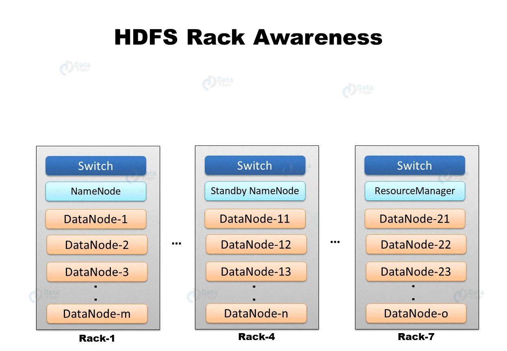
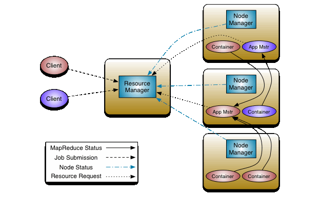

Hadoop Brief User Guide
---
# I/ Introduction
## A/ The genesis of Hadoop

## B/ Hadoop Distributed File System - HDFS
&nbsp;&nbsp;&nbsp;&nbsp;HDFS is the core of the Hadoop ecosystem, which is designed to achieve the following goals:
- Hardware failure/ Fault tolerance: robust to fault detection and automatic recovery mechanisms. Files stored in HDFS are split
into chunks called blocks, which are analogous to block on disk storage. Each block is either 64 or 128 Mb, which is utterly larger than
a default block size on disk - 512Kb. Plus, depending on __*replication factor*__ config, blocks are replicated across cluster nodes.
Due to the nature of bigger block size, HDFS is more efficient at storing large files because we're gonna make a lot of sparse space for each small file.
Technically speaking, if the size of blocks is too small, then more metadata will be stored in
NameNode(s), causing more RAM consumption, and this will also result in more remote procedural calls (RPCs) to NameNode ports, which may result in resource contention.

- Stream Data Access: optimized for batch processing of large datasets, which emphasizing high throughput over low latency.
The system is structured around __*write-once, read-many-times paradigm*__, which means that modifying written data would require more effort.

- "Moving computation is cheaper than moving data": computations should be executed near the data they operate on,
especially for large datasets. 

- Platform-agnostic due to written in Java

### 1/ Key components ([this](../misc/hadoop/hdfs_arch.png))
#### a/ NameNode (master) \& DataNode (slave)

&nbsp;&nbsp;&nbsp;&nbsp;To give a simple overview of HDFS architecture, we assume that
- 1 name node (master)
- 2 data nodes (slaves)
- 1 read client \& 1 write client
The NameNode is the __*arbitrator*__ and __*repository*__ for all HDFS metadata. The system is designed in such a way that user data never flows through the NameNode.
After being spun up, a master server manages the file system namespace and regulates access to file by clients, and slaves are responsible for
serving read/ write requests from clients.

  

&nbsp;&nbsp;&nbsp;&nbsp;To be more detailed, NameNode stores an FS tree, metadata of files \& directories, and all of them are embodied in 3 file types:
__*FS namespace*__, __*image files (fsimage)*__, __*edit logs files*__. FS namespace is for file contents, _fsimage_ is for
the state of FS at a point in time, and edit logs are for recording all changes to FS (_creation, modification, truncation, deletion_)
are made to each FS file after the last _fsimage_ created.

 
 

&nbsp;&nbsp;&nbsp;&nbsp;In terms of __*data group*__, there are two important concepts: __*block*__ and __*replication factor*__.
__*Block*__ defines the minimum amount of data that HDFS can be read/ write at a time. The Hadoop's creator implements a rack-aware replica
management policy, which says
- replica on one __*node*__ <= 1
- replicas on the same __*rack*__ <= 2
- a num of racks for block replication should always ⇐ a num of replicas. Formula for upper limit: (replica_factor - 1) / racks + 2 
Before going into details, it should be noted that the intercommunication among racks would be less efficient than
intra-rack communication, thus increasing R/W latency. Due to the cloning of blocks across the cluster, the placement of replicas is __*critical to*__ HDFS _reliability_ and _performance_.
To achieve the optimal performance for an entire system, we should tune this feature carefully. However, after adding the support for [Storage types and Storage policies](https://hadoop.apache.org/docs/r3.4.2/hadoop-project-dist/hadoop-hdfs/ArchivalStorage.html),
the NameNode takes the new policy into account in lieu of the previous rack-aware policy. 

#### b/ Filesystem Namespace
&nbsp;&nbsp;&nbsp;&nbsp;HDFS supports a hierarchical file organization. Unlike S3 and S3-compatible storage services (e.g., MinIO), stored data's name
is not __*hashed*__. Noted that HDFS does not support hard links or soft links; however, the HDFS architecture does not preclude implementing these features.

#### c/ Communication Protocols
&nbsp;&nbsp;&nbsp;&nbsp;All HDFS communication protocols are layered atop a TCP/IP model, and they are wrapped by Remote Procedure Call (RPC)
abstraction. By design, the NameNode never initiates any RPCs. Instead, it only responds to RPC requests issued by DataNodes or clients.

### 2/ Accessibility
&nbsp;&nbsp;&nbsp;&nbsp;HDFS offers multiple interfaces, including local file, HDFS, FTP, S3, Azure, Swift, etc. See Hadoop's official documentation for more details.

## C/ Hadoop Yet Another Resource Negotiator - YARN

&nbsp;&nbsp;&nbsp;&nbsp;The fundamental idea of YARN is to split up the functionalities of resource management and job scheduling/monitoring into separate daemons.
The idea is to have a global ResourceManager (RM) and per-application ApplicationMaster (AM). An application is either a single job or a DAG of jobs.
Here is a step-by-step execution of YARN [this](../misc/hadoop/yarn_job_execution.png):
<ol>
  <li>Application submission, which can be a MapReduce or a Spark job</li>
  <li>Resource negotiation: Resource Manager negotiates resources with Node Manager in each node</li>
  <li>Container allocation: Once negotiated successfully, RM allocates a container to the application</li>
  <li>Container launch: NM launches the allocated container on their respective nodes</li>
  <li>Application execution: The summited task is executed inside the provided container</li>
  <li>Resource monitoring: NM continuously monitors the container's resource usage and reports back to RM</li>
  <li>Resource management: RM keeps track of all running applications as well as resource usage, and can make necessary adjustments dynamically.</li>
  <li>Resource release: RM releases all occupied resources</li>
</ol>

### 1/ Key components
#### a/ Resource Manager
&nbsp;&nbsp;&nbsp;&nbsp;Being analogous to the master-slave paradigm of HDFS, __*resource manager*__ is the __*conciliator*__ for resource allocation and scheduling.
It comprises two main components: Scheduler and ApplicationMaster (AM).
- Scheduler: allocating resources to the various running applications subject to familiar constraints of capacities, queues, etc.
This scheduler offers no guarantees about __*restarting failed*__ tasks either due to _application failure_ or _hardware failures_.
It only makes an allotment based on info from an abstract notion of a __*resource Container*__, which incorporates elements such as memory, cpu, disk, network, etc.
In addition, the _scheduler_ has a pluggable policy, for instance, [Capacity Scheduler](https://hadoop.apache.org/docs/r3.4.2/hadoop-yarn/hadoop-yarn-site/CapacityScheduler.html) or [Fair Scheduler](https://hadoop.apache.org/docs/r3.4.2/hadoop-yarn/hadoop-yarn-site/FairScheduler.html). 

- ApplicationMaster: The AM responsible for accepting __*job-submissions*__, negotiating appropriate __*resource containers*__ from the Scheduler, tracking their __*status*__ and monitoring for __*progress*__.
#### b/ Node Manager
&nbsp;&nbsp;&nbsp;&nbsp;Node Manager operates on individual nodes within cluster, and responsible for monitoring resource usage on their respective nodes.
They also manage the lifecycle of containers, which are isolated execution environments for running applications.
#### c/ Containers
&nbsp;&nbsp;&nbsp;&nbsp;Containers are the smallest unit of resource allocation in YARN. They encapsulate resource requirements, such as CPU, memory, and
other necessary configurations, for a specific application.

### 2/ Benefits
- Multi-tenancy
- Scalability
- Federation
- Flexibility
- Enhanced cluster utilization
- Resource isolation

## D/ The MapReduce Paradigm ([this](../misc/hadoop/map_reduce_framework.png))
### 1/ Anatomy of a MapReduce
&nbsp;&nbsp;&nbsp;&nbsp;MapReduce simplifies distributed computing by breaking it down into
two essential phases: __*Mapping*__ and __*Reducing*__. This approach draws inspiration from __*functional programming*__ concepts.
- __*Mapping*__: data is divided into smaller chunks and processed in parallel
- __*Shuffle \& Sort*__: reorganizes the intermediate key-value result created by the mappers and ensures that all values with the same key are grouped together.
- __*Reducing*__:  applying a reduction operation to the grouped and sorted key-value pairs

## E/ Configurations
&nbsp;&nbsp;&nbsp;&nbsp;Hadoop config files play a key role in the setup and operation of a Hadoop ecosystem. These configurations
contain various parameters that control the behavior of Hadoop components. They are broken down as follows:
- __*core-site.xml*__: core config settings used by Hadoop's common services and libraries. We can specify properties related to _filesystems URLs_, _security-related settings_, _communication-related settings_, etc.
- __*hdfs-site.xml*__: HDFS-specific configuration settings. We can specify properties related to _block replication_, _block size_, _data node directories_, etc. 
- __*mapred-site.xml*__: used for configuring MapReduce framework. We can specify properties related to _job tracker address_, _task tracker slots_, _map-reduce settings_, etc.
- __*yarn-site.xml*__: used for configuring YARN. We can specify properties related to _num of resource managers_, _node manager address_, _memory management_, log aggregation policies, etc. 
These XML config files are stored in /etc/hadoop directory.

  
Apart from those XML files, we also have __*hadoop-env.sh*__, __*yarn-env.sh*__, __*mapred-env.sh*__

### 1/ Default Ports
#### a/ Name node ([v2](https://hadoop.apache.org/docs/r2.10.2/hadoop-project-dist/hadoop-common/core-default.xml) - [v3](https://hadoop.apache.org/docs/r3.4.2/hadoop-project-dist/hadoop-common/core-default.xml))
__*NameNode*__:
- HTTP Web UI: 50070 (v2) -> 9870 (v3)
- HTTPS Web UI: 50470 (v2) -> 9871 (v3)
- Inter-Process Communication (IPC): 8020
- FileSystem: 9000

 

__*Secondary NameNode*__:
- HTTP Web UI: 50090 (v2) -> 9868 (v3)
- HTTPS Web UI: 50091 (v2) -> 9869 (v3)

 

__*Backup*__
- RPC: 50100
- HTTP Web UI: 50105

#### b/ Data node ([v2](https://hadoop.apache.org/docs/r2.10.2/hadoop-project-dist/hadoop-common/core-default.xml) - [v3](https://hadoop.apache.org/docs/r3.4.2/hadoop-project-dist/hadoop-common/core-default.xml))
__*DataNode*__:
- HTTP: 50075 (v2) -> 9864 (v3)
- HTTPS: 50475 (v2) -> 9865 (v3)
- HTTP Web GUI: 50070 (v2) -> 9870 (v3)
- Data transfer: 50010 (v2) -> 9866 (v3)
- Data streaming, aka IPC: 50020 (v2) -> 9867 (v3)

#### c/ YARN ([v2](https://hadoop.apache.org/docs/r2.10.2/hadoop-yarn/hadoop-yarn-common/yarn-default.xml) - [v3](https://hadoop.apache.org/docs/r3.4.2/hadoop-yarn/hadoop-yarn-common/yarn-default.xml))
__*Resource Manager*__
- HTTP Web UI: 8088
- HTTPS Web UI: 8090
- Scheduler: 8030
- Resource tracker: 8031
- Applications Manager Interface: 8032
- Admin: 8033

 

__*Node Manager*__
- HTTP Web UI: 8042
- HTTPS Web UI: 8044
- Collector Service: 8048
- Container manager/ Localizer IPC: 8040

 

__*Timeline/ History Server*__
- HTTP Web UI: 8188
- HTTPS Web UI: 8190
